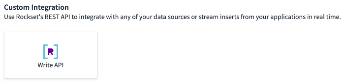
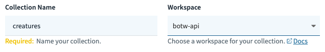
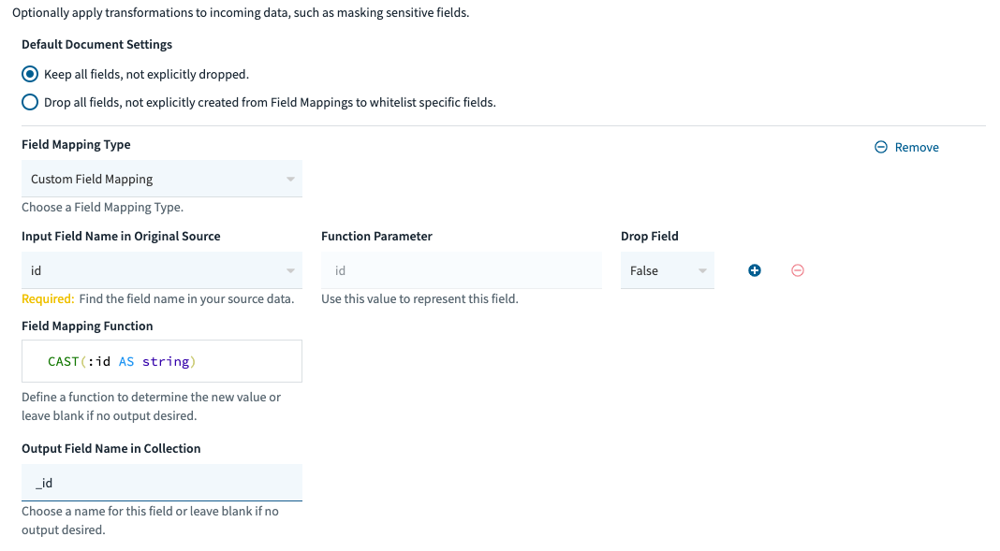

# Running locally

### Enviroment setup

Install the [dependencies](../requirements.txt).

    $ pip3 install -r requirements.txt    # from the base directory

Now to authorize access to your Rockset account retrive your api key from the rockset console and set an enviroment variable called `RS2_TOKEN` for it.
To set a permanant enviroment variable on mac and linux:

    $ echo "export RS2_TOKEN=<api key>" >> ~/.bashrc
    $ source ~/.bashrc

On windows:

    $ echo "RS2_TOKEN=<api key>" > .env    # from the base directory

To set a session-long enviroment variable, use `export`.

    $ export RS2_TOKEN=<api key>

### Setup your Rockset collections
On your Rockset console, create a new collection. Select "Write API" as a custom integration.



Name your collection "creatures" in a new workspace called "botw-api".



Add the following field mapping:



After clicking "create", create four more collections, named equipment, materials, monsters, and treasure in the same workspace with the same field mappings.

After setting up the collections, add the contents of the files in the [compendium directory](../compendium) in the appropriate collections based of the file names. For example, add the contents of [creatures.json](../compendium/creatures.json) into `"botw_api".creatures`.

    from os import getenv
    from json import loads
    from rockset import Client

    rs = Client(api_key=getenv('RS2_TOKEN'), api_server='api.rs2.usw2.rockset.com')
    col = rs.Collection.retrieve('creatures', workspace='botw-api')

    print(
            col.add_docs(
                loads(
                    open('compendium/creatures.json', 'r').read()
                )
            )
    )

### Running the server

Now run [`wsgi.py`](../wsgi.py).

    python3 wsgi.py

To have it run permanantly, run:

    $ nohup python3 wsgi.py &

The server will, by default, run on port 5000, so head to `http://127.0.0.1:5000`.

    $ open http://127.0.0.1:5000/api/v1/entry/1

To run the server on debug mode, modify [`wsgi.py`](../wsgi.py).

```diff
-app.run()
+app.run(debug=True)
```

And to run on a specific port:

```diff
-app.run()
+app.run(port=<port>)
```