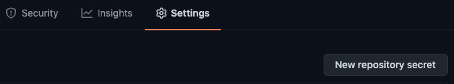

# Running locally

### Setup

Fork this repository and clone it to your local device.

    $ gh repo fork gadhagod/Hyrule-Compendium-API   # with GitHub CLI
    $ git clone https://github.com/<username>/Hyrule-Compendium-API
    $ cd Hyrule-Compendium-API

Install the [dependencies](../requirements.txt).

    $ pip3 install -r requirements.txt    # from the base directory

Now to authorize access to your Rockset account retrive your api key from the rockset console and set an enviroment variable called `RS2_TOKEN` for it.
To set a permanant enviroment variable on mac and linux:

    $ echo "export RS2_TOKEN=<api key>" >> ~/.bashrc
    $ source ~/.bashrc

On windows:

    $ echo "RS2_TOKEN=<api key>" > .env    # from the base directory

To set a session-long enviroment variable, use `export`.

    $ export RS2_TOKEN="<api key>"

### Setup your Rockset collections
On your Rockset console, create a new collection. Select "Write API" as a custom integration.

Name your collection "creatures" in a new workspace called "botw-api".

Add the following field mapping:

After clicking "create", create four more collections, named equipment, materials, monsters, and treasure in the same workspace with the same field mappings.

Go to your cloned repository and add a repository secret named `RS2_TOKEN` with it's value being your API key.

Go to the `actions` tab and run the `add compendium entries` workflow or run [.github/workflows/add-compendium-entries.yml](../.github/workflows/add-compendium-entries.yml)

### Running the server

Now run [`server.py`](../server.py).

    $ python3 server.py

To have it run when the terminal is closed, run:

    $ nohup python3 sever.py &

The server will, by default, run on port 5000, so head to `http://127.0.0.1:5000`.

    $ open http://127.0.0.1:5000/api/v1/entry/1